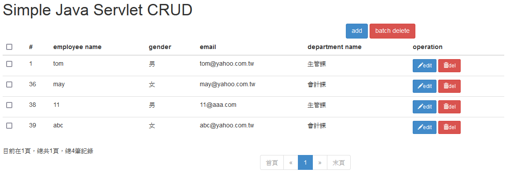
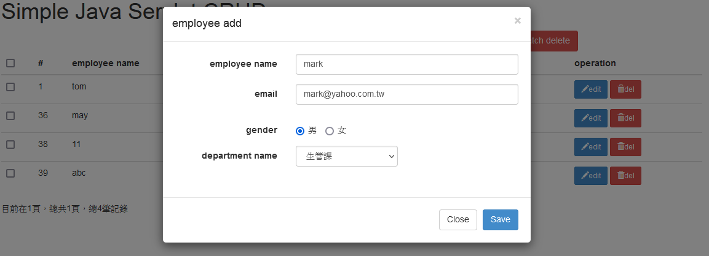
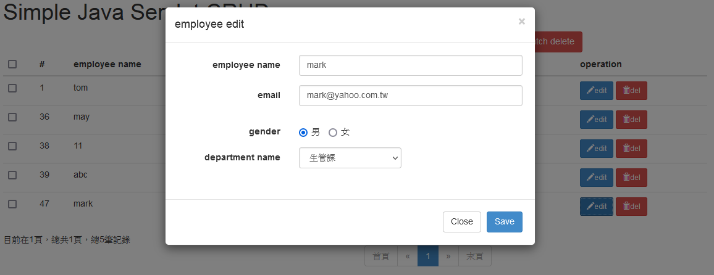

# Simple-Java-Servlet-CRUD

## Preview

**List Page**
 

**Create Page** 
 

**Edit Page**
 

## Technologies Used
- Front-end
  - Bootstrap 3.x
  - jQuery 2.x
  - Ajax
  - JSP
- Back-end
  - Servlet
  - C3P0
  - DBUtil
  - Gson

## Features

- Basic create, read, update, delete and search.
- Pagination.

## Requirements
- Spring Tool Suite 3.9.7.RELEASE
- Java 1.8
- Mysql 5.7
